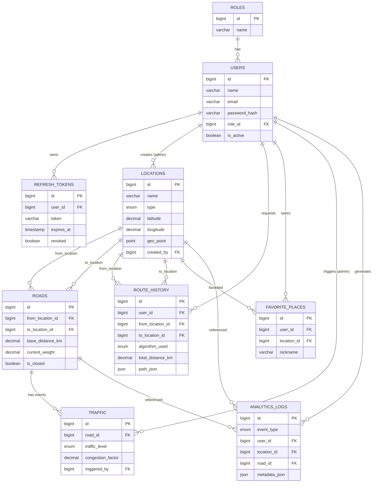

# Smart City Navigation Platform — ER Diagram

## Relationship Summary

| Relationship | Type | Notes |
|---|---|---|
| Role → Users | 1:N | Each user has exactly one role (CITIZEN/ADMIN) |
| User → RefreshTokens | 1:N | A user can have multiple active/expired refresh tokens |
| User → Locations | 1:N (nullable) | Tracks which admin created a location |
| Location → Roads (from) | 1:N | A location can be the source of many roads |
| Location → Roads (to) | 1:N | A location can be the destination of many roads |
| Road → Traffic | 1:N | A road can have a history of traffic events over time |
| User → RouteHistory | 1:N | A user's past route requests |
| User → FavoritePlaces | 1:N | Unique per (user, location) pair |
| User/Location/Road → AnalyticsLogs | 1:N each (nullable) | Central event log for the analytics dashboard |

## Design Notes

- **`geo_point` (SPATIAL, SRID 4326)** on `locations` enables `ST_Distance_Sphere()` queries for the Nearby Services module — MySQL's native equivalent of MongoDB's `2dsphere` index.
- **`roads.current_weight`** is the field the DSA engine reads when building the in-memory graph. `base_distance_km` never changes; `current_weight` is what Traffic Simulation mutates.
- **`route_history.path_json`** stores the ordered node list so history can be replayed on the map without recomputing the route.
- **Unique index on `roads(from_location_id, to_location_id)`** prevents duplicate edges between the same two nodes.
